# Implantação na AWS — README_CLOUD

Este documento descreve uma proposta prática para replicar, na AWS, a arquitetura local do projeto pix-payment-platform. O objetivo é mapear os componentes locais (três microsserviços Spring Boot, RabbitMQ, Redis, Kafka, PostgreSQL e Docker Compose) para serviços gerenciados na AWS, descrevendo onde executar os microsserviços, substituições gerenciadas, requisitos de rede e segurança, estratégias de escalabilidade e alta disponibilidade. Este é um plano técnico: não pressupõe que recursos foram criados ou testados na AWS.

**Resumo das seções:** Introdução; Arquitetura atual; Arquitetura proposta na AWS; Mapeamento local→Cloud; Execução dos microsserviços; Rede e segurança; Amazon MQ (RabbitMQ); ElastiCache (Redis); MSK (Kafka); RDS (PostgreSQL); Escalabilidade; Alta disponibilidade e resiliência; Observabilidade; Diagrama; Fluxo de implantação; Custos e decisões; Conclusão; Referências.

---

## 1. Introdução

Propósito: orientar a equipe a replicar a arquitetura local do sistema de pagamentos via PIX na AWS usando serviços gerenciados, minimizando alterações de código e mantendo o modelo de integração existente (HTTP síncrono + mensagens assíncronas).

Escopo: proposta técnica com decisões arquiteturais e passos de implantação. Não descreve comandos detalhados, scripts de infraestrutura nem assume que a aplicação já foi implantada na AWS.

Premissas: a aplicação continuará com três microsserviços (`ms-pagamento`, `ms-comprovantes`, `ms-notificacao`), comunicação síncrona HTTP entre `ms-pagamento` → `ms-comprovantes`, SAGA via filas RabbitMQ e eventos de pagamento via Kafka; cache Redis e bancos PostgreSQL segregados.

---

## 2. Arquitetura atual (breve)

- Três microsserviços Spring Boot: `ms-pagamento` (8080), `ms-comprovantes` (8081), `ms-notificacao` (8082).
- Comunicação síncrona HTTP entre `ms-pagamento` → `ms-comprovantes`.
- RabbitMQ para filas da SAGA e callbacks (`saga.comprovante.sucesso`, `saga.comprovante.falha`, `comprovante.gerar`).
- Kafka para evento `pagamento.realizado` e tópicos de retry/DLT.
- Redis para cache de comprovantes (cache-aside).
- PostgreSQL segregado por microsserviço.
- Orquestração local via Docker Compose.

Tabela de responsabilidades (resumo):

| Componente local           | Responsabilidade                           |
| -------------------------- | ------------------------------------------ |
| Microsserviços Spring Boot | Lógica de negócio e APIs HTTP              |
| RabbitMQ                   | Filas da SAGA e callbacks                  |
| Kafka                      | Evento de pagamento e streams de retry/DLT |
| Redis                      | Cache de comprovantes (cache-aside)        |
| PostgreSQL                 | Persistência segregada por domínio         |
| Docker Compose             | Execução local de containers               |

---

## 3. Arquitetura proposta na AWS (visão geral)

Visão principal recomendada: executar containers em Amazon ECS com AWS Fargate, armazenar imagens em Amazon ECR, expor APIs públicas via Application Load Balancer (ALB) e usar serviços gerenciados para mensageria, cache e bancos de dados:

- Execução de containers: Amazon ECS (Fargate)
- Registro de imagens: Amazon ECR
- Balanceamento: Application Load Balancer
- Mensageria RabbitMQ: Amazon MQ for RabbitMQ
- Cache Redis: Amazon ElastiCache for Redis
- Streaming Kafka: Amazon MSK
- Bancos PostgreSQL: Amazon RDS for PostgreSQL
- Observabilidade: Amazon CloudWatch (logs, métricas, alarmes)
- Segredos: AWS Secrets Manager ou Systems Manager Parameter Store
- Rede: Amazon VPC com sub-redes públicas/privadas

Alternativa curta: Amazon EKS pode ser usado quando a equipe precisa de controle avançado de Kubernetes; contudo, para reduzir esforço operacional e acelerar a migração, ECS Fargate é preferível aqui.

Por que ECS Fargate é adequado: minimiza operação de infraestrutura (sem gerenciar EC2), permite execução de containers com escala automática por serviço, integra-se de forma nativa com ALB, CloudWatch, Secrets Manager e VPC, e reduz tempo de operação comparado ao EKS para a maioria das aplicações de microsserviços.

---

## 4. Mapeamento local → AWS

| Componente local       | Serviço AWS sugerido         | Responsabilidade                               |
| ---------------------- | ---------------------------- | ---------------------------------------------- |
| Containers Spring Boot | ECS Fargate                  | Execução dos microsserviços (task per service) |
| Imagens Docker         | Amazon ECR                   | Registro e versionamento das imagens           |
| RabbitMQ               | Amazon MQ for RabbitMQ       | Filas, exchanges e callbacks da SAGA           |
| Redis                  | Amazon ElastiCache for Redis | Cache de comprovantes (cache-aside)            |
| Kafka                  | Amazon MSK                   | Tópicos de evento, retry e DLT                 |
| PostgreSQL             | Amazon RDS for PostgreSQL    | Persistência segregada por microsserviço       |
| Logs locais            | Amazon CloudWatch            | Logs, métricas e alarmes                       |

RDS: duas opções viáveis

1. Instância RDS única com múltiplos bancos/schemas — reduz custo e simplifica rede. Adequado para ambientes de desenvolvimento e staging.
2. Instâncias RDS separadas por microsserviço — maior isolamento, controle de manutenção e limites independentes. Recomendado para produção quando isolamento e SLAs são prioritários.

---

## 5. Execução dos microsserviços (passos conceituais)

- Construir imagens Docker localmente (ou em CI) e publicar em Amazon ECR.
- Criar uma Task Definition no ECS para cada microsserviço (uma task definition por serviço), configurando a imagem ECR correspondente, limites de CPU/memória e variáveis de ambiente.
- Armazenar segredos e strings de conexão no Secrets Manager (ou Parameter Store) e referenciá-los nas task definitions.
- Criar um serviço ECS (Fargate) por microsserviço, com desired count variável e Auto Scaling.
- Configurar Application Load Balancer e rotas (listeners/target groups) para expor apenas `ms-pagamento` publicamente; `ms-comprovantes` e `ms-notificacao` podem permanecer acessíveis apenas internamente conforme necessidade.
- Comunicação interna via VPC privada: tasks usam ENIs na VPC e se comunicam por endpoints internos. Evitar exposição pública dos serviços que não precisam.

Configuração de variáveis e segredos: mover todas as credenciais e URIs (RDS, Amazon MQ, MSK, ElastiCache) para Secrets Manager; variáveis não sensíveis seguem como env vars via task definition.

---

## 6. Rede e segurança (proposta objetiva)

- VPC com sub-redes privadas e públicas em pelo menos duas Zonas de Disponibilidade (AZs).
- ALB em sub-redes públicas com listeners HTTPS (TLS terminando no ALB ou TLS passthrough conforme políticas de segurança).
- Microsserviços, RDS, ElastiCache, Amazon MQ e MSK em sub-redes privadas.
- Security Groups: regras mínimas, permitindo apenas o necessário (ALB → `ms-pagamento` via porta 80/443; `ms-pagamento` → `ms-comprovantes` via porta de serviço interna; serviços → RDS via porta 5432; serviços → ElastiCache via porta Redis; serviços → Amazon MQ via portas do broker; produtores/consumidores Kafka via portas MSK configuradas).
- Não permitir acesso público direto aos bancos.
- IAM: roles com princípio do menor privilégio (ECS task roles para acessar Secrets Manager, CloudWatch; roles de serviço para ECS e ALB).
- Criptografia: TLS para tráfego entre serviços quando suportado; RDS, ElastiCache, MSK e Amazon MQ com encriptação em repouso habilitada quando disponível.

---

## 7. RabbitMQ na AWS (Amazon MQ)

Uso: substituir o RabbitMQ local por Amazon MQ for RabbitMQ, preservando exchanges, filas e routing keys.

- Filas sugeridas: `comprovante.gerar` (solicitações assíncronas), `saga.comprovante.sucesso`, `saga.comprovante.falha` (callbacks da SAGA).
- Benefício: Amazon MQ preserva client protocol e API do RabbitMQ, reduzindo alterações de código.
- Alta disponibilidade: provisionar brokers em configuração Multi-AZ (Amazon MQ gerencia a replicação e failover).
- Segurança: usar TLS e autenticação via credenciais gerenciadas; controlar acesso via Security Groups e regras de rede.

---

## 8. Redis na AWS (ElastiCache)

Uso: Amazon ElastiCache for Redis para cache de comprovantes, mantendo o padrão cache-aside.

- Configurar cluster com réplica e failover (Multi-AZ) para alta disponibilidade.
- TTL: manter o TTL definido pela aplicação; o documento não altera TTLs — a configuração de expiração deve seguir a aplicação.
- Escalabilidade: aumentar nós ou escolher instâncias maiores; usar réplicas de leitura quando aplicável.

---

## 9. Kafka na AWS (MSK)

Uso: Amazon MSK para gerenciar o tópico `pagamento.realizado`, tópicos de retry e `pagamento.realizado-dlt`.

- Configurar cluster MSK com brokers distribuídos em múltiplas AZs e número de partições que suporte paralelismo desejado.
- Replicação de partições para tolerância a falhas.
- Grupos de consumidores: `ms-notificacao` deve escalar em múltiplas instâncias dentro do mesmo consumer group; garantir que o número de consumers concorrentes não exceda o número de partições ativas, pois consumidores ociosos não processam mais partições do que existem.
- Retenção da DLT: manter retenção suficiente para investigação, arquivamento ou replay conforme política operacional.
- Observação: MSK gerencia brokers; não é necessário administrar ZooKeeper separadamente na maioria dos modos gerenciados.

---

## 10. PostgreSQL na AWS (RDS)

- Uso: Amazon RDS for PostgreSQL para cada banco lógico.
- Backups automáticos, snapshots e restauração ponto-a-tempo configuráveis.
- Multi-AZ para alta disponibilidade e failover automático.
- Réplicas de leitura (Read Replicas) recomendadas para offload de consultas de leitura pesada; não substituem a instância principal para gravações.
- Proteção: restringir acesso via Security Groups e sub-redes privadas; usar criptografia em repouso.

---

## 11. Escalabilidade (resumo prático)

- ECS Fargate: Auto Scaling por serviço (CPU, memória ou métricas customizadas). Cada microsserviço escala de forma independente.
- Kafka/MSK: aumentar partições e brokers para suportar maior taxa de eventos; relacionar número de consumidores concorrentes com número de partições.
- ElastiCache: aumentar número de nós ou usar nós com maior capacidade; habilitar réplica e failover.
- RDS: escalabilidade vertical (instância maior) ou réplicas de leitura para carga de leitura; considerar instâncias separadas por domínio para reduzir contenda.

Observação: consumidores concorrentes não processam mais partições que o tópico possui; planejar partições conforme throughput esperado.

---

## 12. Alta disponibilidade e resiliência

- Deploy multi-AZ para RDS, MSK (brokers distribuídos) e Amazon MQ (Multi-AZ brokers).
- ECS: múltiplas tasks distribuídas entre AZs; ALB direcionando tráfego.
- ElastiCache: réplica e failover configurados.
- Health checks no ALB e nas ECS Tasks; reinício automático de containers com falha.
- Aplicação: retries, backoff e DLT (existente em `ms-notificacao`) para separar retry lógico e infraestrutura de HA.
- Backups automatizados e alarmes para eventos críticos (aumento de filas, DLT, indisponibilidade).

Diferenças importantes: retry da aplicação ( lógica de reexecução/DSL ), alta disponibilidade da infraestrutura (redundância e failover) e recuperação de desastre (restauração e procedimentos com backup). Cada camada deve ser tratada separadamente.

---

## 13. Observabilidade

- Centralizar logs de aplicação no CloudWatch Logs (ECS tasks enviam logs para CloudWatch).
- Métricas: CPU/memória das tasks, latência de requests, número de mensagens nas filas (Amazon MQ), lag e throughput do MSK, uso do ElastiCache, conexões e uso do RDS.
- Alarmes: DLT growth, filas com backlog, erros HTTP 5xx, uso alto de CPU/memória, disponibilidade do cluster MSK/RDS/Amazon MQ.
- Tracing distribuído: considerar evolução para OpenTelemetry ou AWS X-Ray no futuro (opcional).

---

## 14. Diagrama com arquitetura proposta na AWS

---

## 15. Fluxo de implantação (resumido)

1. Construir imagens Docker e publicar em Amazon ECR.
2. Provisionar VPC (sub-redes públicas/privadas) e Security Groups.
3. Provisionar Amazon MQ, MSK, ElastiCache e RDS com configurações Multi-AZ conforme ambiente.
4. Criar secrets no Secrets Manager (strings de conexão, credenciais).
5. Criar Task Definitions e serviços ECS (Fargate) para cada microsserviço.
6. Configurar ALB, listeners e regras de roteamento.
7. Configurar Auto Scaling para serviços ECS, MSK e ElastiCache conforme necessidade.
8. Configurar CloudWatch Logs, métricas e alarmes.
9. Validar fluxo ponta a ponta: chamadas HTTP, SAGA via Amazon MQ, publicação/consumo em MSK, cache Redis e persistência em RDS.

---

## 16. Custos e decisões arquiteturais

- Serviços gerenciados reduzem esforço operacional e tempo de entrega, mas aumentam custo fixo — Amazon MSK, Amazon MQ e configurações Multi-AZ contribuem significativamente para custos.
- Para ambientes de desenvolvimento/staging, considere configurações reduzidas (menos brokers, uma instância RDS com múltiplos bancos) e sem Multi-AZ para economizar custos.
- Para produção, priorize isolamento e disponibilidade: instâncias RDS separadas, MSK com brokers distribuídos e Amazon MQ Multi-AZ.
- ECS Fargate é recomendado quando se quer simplicidade operacional; EKS é alternativa se a equipe já opera Kubernetes e precisa de flexibilidade adicional.

---

## 17. Conclusão

Esta proposta mapeia a arquitetura local do pix-payment-platform para uma implantação prática na AWS usando serviços gerenciados: ECS Fargate (execução de containers), Amazon MQ (RabbitMQ), ElastiCache (Redis), Amazon MSK (Kafka) e Amazon RDS (PostgreSQL). A solução preserva os padrões de comunicação existentes (HTTP síncrono, SAGA via filas, eventos via Kafka), prioriza disponibilidade e isolamento em produção e mantém opções de redução de custos em ambientes menores.

---

## Referências

- Amazon ECS — https://docs.aws.amazon.com/ecs/
- Amazon ECR — https://docs.aws.amazon.com/ecr/
- Application Load Balancer — https://docs.aws.amazon.com/elasticloadbalancing/
- Amazon MQ for RabbitMQ — https://docs.aws.amazon.com/amazon-mq/
- Amazon ElastiCache for Redis — https://docs.aws.amazon.com/elasticache/
- Amazon MSK — https://docs.aws.amazon.com/msk/
- Amazon RDS for PostgreSQL — https://docs.aws.amazon.com/rds/
- AWS Secrets Manager — https://docs.aws.amazon.com/secretsmanager/
- Amazon VPC — https://docs.aws.amazon.com/vpc/
- Amazon CloudWatch — https://docs.aws.amazon.com/cloudwatch/
