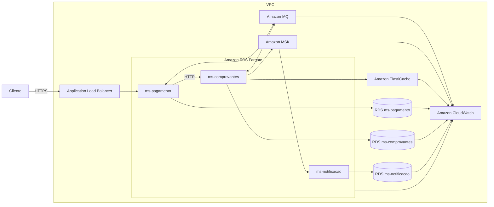

```mermaid
flowchart LR
Client[Cliente]

subgraph VPC[VPC]
ALB[Application Load Balancer]
subgraph ECS[Amazon ECS Fargate]
MP[ms-pagamento]
MC[ms-comprovantes]
MN[ms-notificacao]
end

MQ[Amazon MQ]
MSK[Amazon MSK]
REDIS[Amazon ElastiCache]

RDS1[(RDS ms-pagamento)]
RDS2[(RDS ms-comprovantes)]
RDS3[(RDS ms-notificacao)]

CW[Amazon CloudWatch]

end

Client -->|HTTPS| ALB
ALB --> MP
MP -->|HTTP| MC

MP <--> MQ
MC <--> MQ

MC --> MSK
MSK --> MN

MC --> REDIS

MP --> RDS1
MC --> RDS2
MN --> RDS3

ECS --> CW
MQ --> CW
MSK --> CW
REDIS --> CW
RDS1 --> CW
RDS2 --> CW
RDS3 --> CW

```
